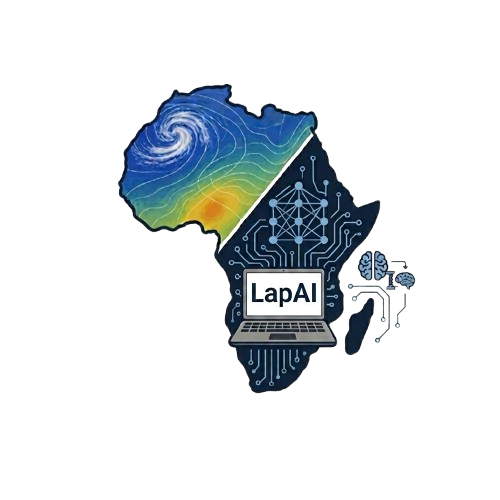

# LapAI-Forecast / Mvula

<p align="center">
  
</p>

Canonical Git repository: [github.com/msovara/lapai-forecast-africa](https://github.com/msovara/lapai-forecast-africa).

The same project often lives under `tiny-media-analysis/lapai-forecast/` on local machines; `origin` should point at the URL above.

**Mvula** (ECMWF Code for Earth 2026 — African Stream) shrinks advanced AI weather models toward laptop-scale use for African contexts.

## Run Mvula locally — no HPC or GPU required

Mvula v5 provides a lightweight AIFS-derived CNN for short-range African 2 m temperature experimentation. It can be run either through a reproducible Apptainer/Singularity container (**Path A**) or directly in a CPU-only Python/Conda environment (**Path B**).

The released student model is approximately **8.8 MiB** and was benchmarked at approximately **2.5 seconds per +6 h** inference step on an Intel i7-11800H laptop.

**Scientific scope:** The validated v5 result is an **analysis-forced African t2m** experiment. The released student has a **partial output state** (Cout=3) and does **not** support autonomous free-running 10-day forecasting. Full claim boundary: [`reports/FINAL_REPORT.md`](reports/FINAL_REPORT.md).

**Mentors — start here:** [`reports/FINAL_REPORT.md`](reports/FINAL_REPORT.md) · [`reports/MVULA_CODE4EARTH_STATUS_MATRIX.md`](reports/MVULA_CODE4EARTH_STATUS_MATRIX.md) · tag [`trackb-v5-c4e`](https://github.com/msovara/lapai-forecast-africa/releases/tag/trackb-v5-c4e) · quickstart below.

### Which path should I use?

| User | Recommended path |
|------|------------------|
| Laptop user | **Path B** — Conda/Python |
| Researcher | Path B or A |
| CHPC / Lengau | **Path A** — Apptainer |
| Reproducibility / paper | **Path A** — pinned container |
| Developer | **Path B** |
| Streamlit demonstration | Either |

Apptainer is **not** required for everyone. Packaging (Path A) is a separate deliverable from the scientific v5 result. The frozen v5 student (~9 MiB) is tracked in git; the Apptainer image still does **not** bake weights (bind-mount `models/` at run time). Details: [`containers/README.md`](containers/README.md).

## Close-out quickstart

```text
Clone (includes v5 ckpt) → Path A (Apptainer) or Path B (conda/pip) → view results / run_mvula
```

Laptop accessibility leads with **Path B**. Apptainer is the **reproducibility** path for mentors/HPC.

1. **Clone**
   ```bash
   git clone https://github.com/msovara/lapai-forecast-africa.git
   cd lapai-forecast-africa
   git checkout trackb-v5-c4e   # freeze tag (includes AF t2m package + laptop bench)
   ```

2. **Checkpoint** (~9 MiB; tracked in git as `models/student_global_stable_v5.ckpt`)
   - Clone of `main` / `trackb-v5-c4e` includes the frozen student weights
   - Cassava mirror (if needed): `/local/Mthetho/lapai-forecast/models/student_global_stable_v5.ckpt`
   - Other weights under `models/` remain gitignored (teachers, etc.)

3. **Path B — conda / pip (laptop)**
   ```bash
   conda env create -f environment-mvula-enduser.yml
   conda activate mvula-enduser
   pip install -e ".[dev,data,ort]"
   pip install -r requirements_streamlit.txt
   python run_mvula.py info
   python run_mvula.py bench          # CPU timing → reports/MVULA_LAPTOP_BENCHMARK.json
   python run_mvula.py dashboard      # or: run_mvula.bat / run_status_dashboard.bat
   ```
   CHPC GPU training envs remain [`environment-credit.yml`](environment-credit.yml) / [`environment-credit-lengau.yml`](environment-credit-lengau.yml).

4. **Path A — Apptainer / Singularity (repro)**
   ```bash
   apptainer build mvula-v5.sif containers/Apptainer.def
   apptainer run -B "$PWD/models:/opt/lapai-forecast/models" mvula-v5.sif info
   apptainer run -B "$PWD/models:/opt/lapai-forecast/models" \
     -B "$PWD/reports:/opt/lapai-forecast/reports" mvula-v5.sif bench
   ```
   Full build/run notes: [`containers/README.md`](containers/README.md). Docker: `docker build -f containers/Dockerfile -t mvula-v5:cpu .`

5. **Results already packaged** (no re-run required to inspect skill)
   - [`reports/FINAL_REPORT.md`](reports/FINAL_REPORT.md) — full close-out narrative (**start here**)
   - [`reports/MVULA_CODE4EARTH_STATUS_MATRIX.md`](reports/MVULA_CODE4EARTH_STATUS_MATRIX.md) — objective → status table
   - [`reports/TRACKB_T2M_EXPANDED.md`](reports/TRACKB_T2M_EXPANDED.md) — 61 inits × leads 6/12/18/24
   - Figures: [+6h RMSE](reports/figures/trackb_t2m_v5_rmse_L006h.png) · [+6h bias](reports/figures/trackb_t2m_v5_bias_L006h.png) · [+24h RMSE](reports/figures/trackb_t2m_v5_rmse_L024h.png) · [+24h bias](reports/figures/trackb_t2m_v5_bias_L024h.png)
   - [`reports/MVULA_LAPTOP_BENCHMARK.md`](reports/MVULA_LAPTOP_BENCHMARK.md) — size / laptop CPU (i7-11800H)
   - Case A limit: [`reports/TRACKB_STATE_CLOSURE.md`](reports/TRACKB_STATE_CLOSURE.md)

6. **Re-run AF t2m eval** (optional; needs ARCO/network + GPU recommended)
   ```bash
   # Cassava example
   bash scripts/run_trackB_t2m_expanded_cassava.sh
   ```

### What Mvula v5 achieves vs limitations

| Achieves | Limitations |
|----------|-------------|
| ~6× smaller than K1; **~2.5 s/step on i7 laptop CPU** | IC fetch/build not in that timing |
| Strong-ish AF **+6 h t2m** on Africa (ACC≈0.97) | **+24 h** degrades sharply vs K1 |
| Open eval + dashboard | **No** free-run / 10-day student |
| Honest Case A docs | **tp** failed / out-of-scope |

---

## Original proposal targets (context)

The proposal aimed at a mid-range laptop (Intel i7, 16 GB RAM, no GPU), a **10-day** 1° global forecast, ≤15% RMSE vs AIFS globally, LoRA adaptation, and ONNX packaging. Those remain the **programme north star**; the **shipped freeze** is the scoped AF t2m + compression result above — see FINAL_REPORT §2.

A compressed, laptop-deployable AI Numerical Weather Prediction (NWP) model distilled from ECMWF AIFS, with regional adaptation for Africa.

## Targets (proposal)

- **Hardware:** Intel i7 CPU, 16 GB RAM, no discrete GPU.
- **Forecast spec:** 10-day global forecast at 1° resolution.
- **Skill envelope:** ≤ 15 % RMSE degradation vs. AIFS baseline globally; ≤ 20 % on African extreme events.
- **LoRA adaptation cost:** ≤ 6 h on a single consumer GPU.
- **Compute budget:** 1,650 GPU-hours total on CHPC.
- **Schedule:** 12 weeks.

## Pathways (one repo)

| Pathway | Location | Role |
| ------- | -------- | ---- |
| **AIFS teacher** | `teachers/aifs/` | Phase 0 Anemoi `n320_gt6` compression teacher; Track A A1 passed Aug 2026 |
| **GraphCast Africa teacher** | `teachers/graphcast/` | Parallel Africa baseline (GCS); see `reports/GRAPHCAST_FIRST.md` |
| **Student** | `students/` | Track A O96 / laptop target (A1 coarsened checkpoint on Lengau) |

Shared Africa eval box: **lat [−40, 40] × lon [−20, 70]** — see `config/domains.yaml` (aligned with graphcast-africa).

## Approach

Two complementary tracks:

| Framework        | Source     | Role                                                                                          |
| ---------------- | ---------- | --------------------------------------------------------------------------------------------- |
| **Anemoi**       | ECMWF      | Track A — structural compression of AIFS: grid coarsening (N320 → N96, processor O96 → O48) and CRPS-gated attention-head pruning. |
| **MILES-CREDIT** | NSF NCAR   | Track B — 10–15 M-parameter InceptionNeXt CNN student trained with area-weighted MAE + AIFS feature distillation (layers 10 & 14) + spectral distillation. |
| **PyTorch + LoRA** | —        | Phase 3 — rank-`r ∈ {4, 8, 16, 32}` adapters fine-tuned over Africa using ERA5 + ENACTS.       |
| **ONNX Runtime** | —          | Phase 4 — laptop-deployable inference package (Python + ONNX, with Docker / Singularity).     |

```
ECMWF AIFS  ──►  Track A (Anemoi: coarsen + prune)  ──►  pruned teacher
                                                              │
                                                              ▼
ERA5  ─────────────►  Track B (MILES-CREDIT student CNN, distillation losses)
                                                              │
                                                              ▼
                              Phase 3 — LoRA over Africa (ERA5 + ENACTS)
                                                              │
                                                              ▼
                              Phase 4 — ONNX export + `lapai_inference` package
```

## Teacher checkpoint (AIFS Single v1.0)

**Fast path (CHPC):** follow the *Minimal copy-paste path* in [`reports/RUNBOOK_BASELINE_LENGAU.md`](reports/RUNBOOK_BASELINE_LENGAU.md) after loading **`lapai-anemoi`**.

Pinned in [`configs/teacher_aifs.yaml`](configs/teacher_aifs.yaml). Download weights (**`huggingface_hub`** is listed in [`environment-anemoi.yml`](environment-anemoi.yml); purely local pip setups can use `pip install -e ".[hf]"`).

```bash
python scripts/download_teacher_ckpt.py --local-dir models/teacher
bash scripts/lapai_inference_gate.sh   # ckpt smoke + verify --strict + inference --dry-run
# optional: export LAPAI_INFER_TEMPLATE=configs/inference_aifs_netcdf_example.yaml
python scripts/run_aifs_inference.py   # anemoi-inference run (omit internal --dry-run; requires GPU/driver)
# or: qsub pbs/inference_aifs_teacher.pbs
#     qsub -v LAPAI_AIFS_INFER_DRY=1 pbs/inference_aifs_teacher.pbs
```

The Hugging Face file name is **`aifs-single-mse-1.0.ckpt`**; `revision` is pinned next to `checkpoint_filename` in [`configs/teacher_aifs.yaml`](configs/teacher_aifs.yaml). `scripts/download_teacher_ckpt.py` picks up that revision by default (`--revision ""` to float with `main`).

Template for **`anemoi-inference`**: [`configs/inference_aifs_minimal.yaml`](configs/inference_aifs_minimal.yaml). Week‑1 checklist: [`reports/RUNBOOK_BASELINE_LENGAU.md`](reports/RUNBOOK_BASELINE_LENGAU.md). **Troubleshooting (gate / PBS / YAML):** same file, **§7**.

After saving NetCDF forecasts, cosine‑latitude RMSE vs truth (JSON on stdout):

`python -m evaluation.eval_skill --pred-netcdf PATH --truth-netcdf PATH --var VAR [--isel time=0,step=…]`

Torch dict mode (keys `pred` / `era5`): `python -m evaluation.eval_skill --blob MODEL.pt`.

Install **`pip install -e ".[data]"`** when using NetCDF/Zarr.

## Repository status

The long-form technical plan (layouts, compute budget, risks, milestones) is in [`PLAN.md`](PLAN.md).

This tree includes a **working scaffold** aligned with that plan: student CNN (`lapai_inference`), distillation losses (`utils/losses_distillation.py`), cache schema (`lapai_inference/cache_schema.py`), Track A stub (`training/train_trackA.py`), training / LoRA / sensitivity drivers, evaluation hooks, ONNX export, `infer.py`, PBS templates, conda env YAMLs, and `dvc.yaml` stub. ECMWF Anemoi / challenge scorecards and real checkpoints still need to be wired per `PLAN.md` Week 1 gates.

Install locally:

```bash
cd lapai-forecast
pip install -e ".[dev,ort]"
# optional lightweight overlap: pip install -r requirements.txt  (UTF-8; CHPC stacks use conda YAMLs)
pytest
```

## Workflow (local vertical slice)

1. Demo teacher cache (random fields, schema-compliant shapes):

   `python training/build_demo_zarr_cache.py --out data/processed/demo_teacher_cache.zarr`

2. Train from that cache:

   `python training/train_student.py --cache data/processed/demo_teacher_cache.zarr --epochs 5 --batch_size 4`

3. Synthetic smoke (no Zarr):

   `python training/train_student.py --epochs 3 --steps_per_epoch 8`

Swap the demo store for real Anemoi/AIFS exports aligned with `lapai_inference/cache_schema.py` (`state_in`, `era5_target`, `teacher_pred`, `teacher_feat_L10`, `teacher_feat_L14`).

## Track B — reproduce analysis-forced t2m evaluation (v5 freeze)

**Close-out:** [`reports/FINAL_REPORT.md`](reports/FINAL_REPORT.md) · methodology [`reports/TRACKB_METHODOLOGY_HANDOVER.md`](reports/TRACKB_METHODOLOGY_HANDOVER.md) · Case A [`reports/TRACKB_STATE_CLOSURE.md`](reports/TRACKB_STATE_CLOSURE.md).

Frozen student: `models/student_global_stable_v5.ckpt` (Cout=`tp/msl/2t`; **Case A** — no free-run). Primary gate variable: **t2m**. tp is out-of-scope.

Packaged results (preferred for reviewers): [`reports/TRACKB_T2M_EXPANDED.md`](reports/TRACKB_T2M_EXPANDED.md).

```bash
# Cassava (GPU1 + public ARCO ERA5 ICs; no CDS)
cd /local/Mthetho/lapai-forecast
bash scripts/run_trackB_t2m_expanded_cassava.sh
# → reports/TRACKB_T2M_EXPANDED.json / .md
# → reports/figures/trackb_t2m_v5_{bias,rmse}_L{006,024}h.png
```

Protocol: for each lead \(L\in\{6,12,18,24\}\), IC at `init+(L−6)h` → one +6h student step (analysis-forced). Production campaign: **61** inits across four seasons. Release tag: **`trackb-v5-c4e`**.

Laptop CPU size/speed (i7-11800H measured):

```bash
export CUDA_VISIBLE_DEVICES=
export OMP_NUM_THREADS=4 MKL_NUM_THREADS=4 MKL_INTERFACE_LAYER=GNU
python -u scripts/bench_mvula_laptop_v5.py
```

## CHPC Lengau environments

**Operations guide:** see [`docs/LENGAU.md`](docs/LENGAU.md) — PBS **Track A** defaults to isolated **`lapai-anemoi`** ([`environment-anemoi.yml`](environment-anemoi.yml): PyTorch + CUDA + Anemoi packages). **Track B / LoRA** uses **`lapai-credit`** ([`environment-credit-lengau.yml`](environment-credit-lengau.yml)). Override with `LAPAI_CONDA_TRACK_A` / `B` for CHPC shared stacks.

On **Lengau**, clone this repo (or use `tiny-media-analysis/lapai-forecast`), then from the repo root:

```bash
bash scripts/setup_lengau_envs.sh
```

This loads **`module load chpc/python/anaconda/3-2024.10.1`** (adjust if `module avail` shows a newer Anaconda), creates **`lapai-anemoi`** from [`environment-anemoi.yml`](environment-anemoi.yml), and **`lapai-credit`** from [`environment-credit-lengau.yml`](environment-credit-lengau.yml) (PyTorch + **CUDA 12.1** via conda `nvidia`). Dependencies come from the YAML so PyTorch is not overwritten by pip; the script ends with **`python -m pip install -e . --no-deps`** to register the `lapai_inference` packages.

Optional: store envs on lustre if `$HOME` quota is tight:

```bash
export CONDA_ENVS_PATH=/mnt/lustre/users/$USER/conda-envs
mkdir -p "$CONDA_ENVS_PATH"
bash scripts/setup_lengau_envs.sh
```

GPU batch jobs (matches patterns used elsewhere on CHPC):

```bash
module load chpc/python/anaconda/3-2024.10.1
module load chpc/cuda/12.0/12.0
source /home/apps/chpc/bio/anaconda3-2024.10.1/etc/profile.d/conda.sh
conda activate lapai-credit
```

If conda solves are slow on the login node, submit [`pbs/setup_env_lengau.pbs`](pbs/setup_env_lengau.pbs) from the repo root (edit `cd` line if needed).

## Layout (implemented scaffold)

```
lapai-forecast/
├── PLAN.md                  Technical plan
├── README.md                This file
├── pyproject.toml           Package metadata (`lapai_inference`, utils, evaluation, training, inference)
├── requirements.txt
├── environment-anemoi.yml          Track A conda sketch
├── environment-credit.yml          Track B / ONNX conda sketch
├── environment-mvula-enduser.yml   Path B laptop CPU conda env
├── run_mvula.py / run_mvula.bat    End-user entry (info / bench / dashboard)
├── infer.py                        ONNX demo CLI (delegates to lapai_inference)
├── dvc.yaml                        DVC stub stage (extend after `dvc init`)
├── configs/                        YAML knobs for student, LoRA, eval, Track A
├── recipes/                        Placeholders for Anemoi ERA5 recipes
├── lapai_inference/                Model, cache schema, dataset, preprocess/postprocess, CLI
├── utils/                          Losses, grid coarsen, LoRA, ONNX export
├── evaluation/                     Baseline gate, skill + Africa extremes helpers
├── training/                       train_student, build_demo_zarr_cache, train_trackA, train_lora, run_sensitivity
├── inference/                      PyTorch rollout + ONNX Runtime benchmark
├── diagnostics/plot/               Callback config placeholder
├── containers/                     Apptainer.def + Dockerfile + README (Path A)
├── pbs/                            CHPC job scripts
├── tests/                          Unit smoke tests
├── data/, models/, logs/           Gitignored artefacts
└── reports/
```

## License

To be selected before the first code commit. Default plan: Apache-2.0 for code, CC-BY-4.0 for documentation, with model weights under a permissive open-weights licence compatible with NMHS redistribution.

## Acknowledgements

- ECMWF for the AIFS public checkpoints and the Anemoi framework.
- NSF NCAR MILES for the CREDIT framework.
- The Centre for High-Performance Computing (CHPC), South Africa, for compute resources.
- Code for Earth — African Stream.
