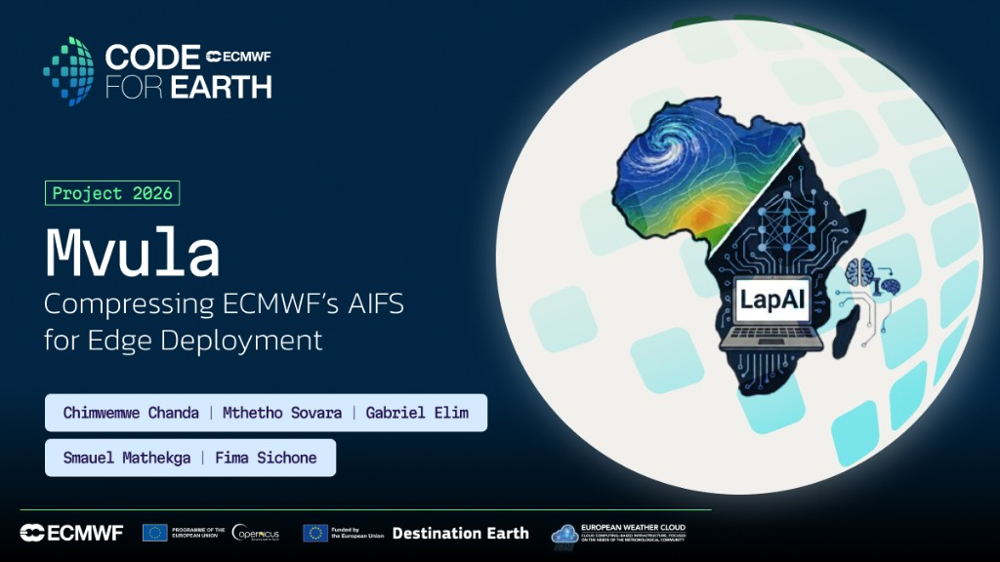

# LapAI-Forecast / Mvula

<p align="center">
  
</p>

<p align="center">
  <a href="https://share.streamlit.io/deploy?repository=msovara/lapai-forecast-africa&branch=main&mainModule=streamlit_status.py"></a>
</p>

**Mvula** (ECMWF Code for Earth 2026 — African Stream) compresses ECMWF AIFS toward laptop-scale African weather experimentation.

Canonical repo: [github.com/msovara/lapai-forecast-africa](https://github.com/msovara/lapai-forecast-africa) · freeze tag [`trackb-v5-c4e`](https://github.com/msovara/lapai-forecast-africa/releases/tag/trackb-v5-c4e)

**Start here:** [`reports/FINAL_REPORT.md`](reports/FINAL_REPORT.md) · [`reports/MVULA_CODE4EARTH_STATUS_MATRIX.md`](reports/MVULA_CODE4EARTH_STATUS_MATRIX.md)

## What shipped (v5)

| | |
|--|--|
| **Model** | ~8.8 MiB student CNN (`models/student_global_stable_v5.ckpt`, tracked in git) |
| **Laptop** | ~2.5 s per +6 h step on Intel i7-11800H CPU |
| **Skill** | Analysis-forced African **t2m** (61 inits × leads 6/12/18/24 h) |
| **Not claimed** | Free-run / 10-day forecast; Cout=65 full-state student; **tp** skill |

Full claim boundary and proposal-vs-delivered: FINAL_REPORT §2–4.

| Achieves | Limitations |
|----------|-------------|
| ~6× smaller than K1; laptop CPU inference | IC fetch/build not in that timing |
| Strong AF **+6 h t2m** on Africa (ACC≈0.97) | **+12/+24 h** degrade; cold bias at +12 h |
| Open eval package + Streamlit dashboard | **No** autonomous multi-day rollout |
| Honest Case A docs | **tp** failed / out of scope |

## Run locally (no HPC/GPU required)

| User | Path |
|------|------|
| Laptop / demo | **B** — Conda/Python |
| CHPC / paper reproducibility | **A** — Apptainer ([`containers/README.md`](containers/README.md)) |

### 1. Clone

```bash
git clone https://github.com/msovara/lapai-forecast-africa.git
cd lapai-forecast-africa
git checkout trackb-v5-c4e   # optional freeze tag
```

Checkpoint ships with the clone (`models/student_global_stable_v5.ckpt`). Cassava mirror if needed: `/local/Mthetho/lapai-forecast/models/…`.

### 2. Path B — conda (recommended on a laptop)

```bash
conda env create -f environment-mvula-enduser.yml
conda activate mvula-enduser
pip install -e ".[dev,data,ort]"
pip install -r requirements_streamlit.txt
python run_mvula.py info
python run_mvula.py bench
python run_mvula.py dashboard
```

### 3. Path A — Apptainer

```bash
apptainer build mvula-v5.sif containers/Apptainer.def
apptainer run -B "$PWD/models:/opt/lapai-forecast/models" mvula-v5.sif info
apptainer run -B "$PWD/models:/opt/lapai-forecast/models" \
  -B "$PWD/reports:/opt/lapai-forecast/reports" mvula-v5.sif bench
```

Weights are **bind-mounted**, not baked into the SIF. Docker: `containers/Dockerfile`.

### 4. Packaged results (no re-run needed)

- [`reports/FINAL_REPORT.md`](reports/FINAL_REPORT.md) — close-out narrative
- [`reports/TRACKB_T2M_EXPANDED.md`](reports/TRACKB_T2M_EXPANDED.md) — AF t2m scorecard
- [`reports/MVULA_XAI_ATTRIBUTION.md`](reports/MVULA_XAI_ATTRIBUTION.md) — Fig.11 channel/spatial saliency
- [`reports/MVULA_LAPTOP_BENCHMARK.md`](reports/MVULA_LAPTOP_BENCHMARK.md) — size / CPU timing
- Figures: [+6 h RMSE](reports/figures/trackb_t2m_v5_rmse_L006h.png) · [+6 h bias](reports/figures/trackb_t2m_v5_bias_L006h.png) · [+24 h RMSE](reports/figures/trackb_t2m_v5_rmse_L024h.png) · [+24 h bias](reports/figures/trackb_t2m_v5_bias_L024h.png) · [Fig.10 spatial](reports/figures/mvula_fig10_t2m_spatial_6h_24h_quad.png) · [Fig.11 XAI](reports/figures/mvula_fig11_t2m_xai_attribution.png)

Optional re-eval (ARCO + GPU recommended): `bash scripts/run_trackB_t2m_expanded_cassava.sh`

## Approach (brief)

| Track | Role |
|-------|------|
| **A — Anemoi** | Structural compression of AIFS (grid / attention) |
| **B — CREDIT CNN** | Distilled student for African t2m (shipped freeze) |

Programme plan: [`PLAN.md`](PLAN.md). CHPC Lengau ops: [`docs/LENGAU.md`](docs/LENGAU.md). Teacher download / inference runbook: [`reports/RUNBOOK_BASELINE_LENGAU.md`](reports/RUNBOOK_BASELINE_LENGAU.md).

```
AIFS  →  Track A (coarsen / prune)  →  teacher
ERA5  →  Track B (CREDIT student + distillation)  →  Mvula v5
                                              →  Path A/B packaging + ONNX path
```

## Layout

```
configs/  containers/  evaluation/  lapai_inference/  models/  reports/
run_mvula.py  scripts/  training/  utils/  pbs/  tests/
```

GPU training envs: `environment-credit.yml` / `environment-credit-lengau.yml` (CHPC). End-user CPU env: `environment-mvula-enduser.yml`.

## License

Source code in this repository is licensed under the [Apache License 2.0](LICENSE).

- **Documentation** (reports, guides, figures under `reports/` and `docs/`): [CC BY 4.0](https://creativecommons.org/licenses/by/4.0/).
- **Student checkpoint** (`models/student_global_stable_v5.ckpt`): provided for research and evaluation; redistribution for NMHS / research use is intended to be permissive. Third-party **teacher** weights (e.g. AIFS) remain under their original licences and terms.
- See also [`NOTICE`](NOTICE) for attribution.

## Acknowledgements

- **Cassava AI Factory** ([Cassava Technologies](https://www.cassava.ai/)) — GPU access for student training, AF evaluation, and related workloads.
- **Centre for High Performance Computing (CHPC)**, South Africa (Lengau) — HPC compute and environment support.
- **ECMWF** — AIFS checkpoints and Anemoi.
- **NSF NCAR MILES** — CREDIT framework (Track B).
- **ECMWF Code for Earth** — African Stream mentoring and programme support.
