# Mvula: Compressing ECMWF AIFS for Laptop-Scale African Short-Range Temperature Forecasting

**Draft paper / technical report — Code for Earth 2026 (African Stream)**  
**Status:** Draft for mentor review (aligned with v5 science freeze)  
**Version:** 2026-09-01  
**Repository:** [github.com/msovara/lapai-forecast-africa](https://github.com/msovara/lapai-forecast-africa)  
**Release tag:** [`trackb-v5-c4e`](https://github.com/msovara/lapai-forecast-africa/releases/tag/trackb-v5-c4e)  
**Companion close-out:** [`FINAL_REPORT.md`](FINAL_REPORT.md)

**Authors (Team Mvula):** Chimwemwe Chanda, Mthetho Sovara, Samuel Mathekga, Gabriel Elim, Fima Sichone  
**Mentors:** Shruti Nath, Rendani Mbuvha, Mario Santa Cruz López  
**Programme:** ECMWF Code for Earth 2026 — African Stream  

---

## Abstract

Data-driven global weather models such as ECMWF’s Artificial Intelligence Forecasting System (AIFS) achieve strong skill but remain expensive to run and redistribute for edge or National Meteorological and Hydrological Service (NMHS) settings. **Mvula** (LapAI-Forecast) explores architectural compression of AIFS toward laptop-scale use, with evaluation focused on Africa.

We deliver a frozen **distilled convolutional student** (`student_global_stable_v5.ckpt`, ≈8.8 MiB, ≈2.17 M parameters) trained from a pruned AIFS-derived teacher (K1). Under an **analysis-forced** protocol over Africa, 61 seasonal initialisations in 2023 show that **+6 h 2 m temperature (t2m)** is relatively strong (RMSE ≈1.38 °C, ACC ≈0.97; ≈+17% RMSE vs K1 on a small K1 subset), while skill degrades sharply by **+12 h** (systematic cold bias) and remains degraded at **+24 h** (RMSE ≈3.23 °C; ≈+103% vs K1). The student runs on a consumer laptop CPU (Intel i7-11800H) in ≈2.5 s per +6 h step without a discrete GPU.

**Claim boundary:** this work demonstrates **compression + short-range African AF t2m**, not a free-running 10-day AIFS replacement, not full-state NWP emulation, and not LoRA/ONNX productisation. Precipitation skill for the Cout=3 head failed and is out of scope.

---

## 1. Introduction

### 1.1 Motivation

Operational and research AI weather models are transforming forecast production, but their compute and memory footprints limit use on ordinary laptops and in bandwidth- or GPU-constrained African contexts. Code for Earth Challenge 40 asked whether AIFS-class models can be compressed for **edge deployment** while retaining useful skill where it matters regionally.

### 1.2 Original ambition vs delivered scope

The original Mvula plan targeted a mid-range laptop (CPU-only), a **10-day** 1° global forecast, ≤15% RMSE degradation vs AIFS globally, LoRA adaptation over Africa, and ONNX packaging. Those remain programme north-star goals. The **shipped freeze** is intentionally narrower:

| Ambition (proposal / PLAN) | Delivered (v5 freeze) |
|----------------------------|------------------------|
| Free-running 10-day student | **Not demonstrated** (architecturally impossible on Cout=3) |
| Full-state I/O | Cin=65 → **Cout=3** (`tp`, `msl`, `2t`) |
| Multi-variable Week-9 table | **t2m-only**, leads 6/12/18/24 h, analysis-forced |
| LoRA + quantisation + ONNX | Scaffold / future work |
| Laptop deployment evidence | **Measured** CPU size and timing |

This paper tells that story honestly: what compression bought, where skill holds, where it fails, and why.

### 1.3 Contributions

1. An end-to-end **Track A → Track B** path from AIFS teacher compression to a small CNN student.  
2. A packaged **African AF t2m** evaluation (61 inits × 4 leads) with spatial maps and seasonal breakdowns.  
3. **Explainability** of African-mean 2t sensitivity and a diagnostic of the +12 h cold-bias failure.  
4. A **consumer-laptop** inference benchmark and open packaging (conda / Apptainer, dashboard, Apache-2.0 code).

---

## 2. Methods

### 2.1 Overall pipeline

Figure 1 summarises the Mvula workflow: structural compression of an AIFS-family teacher, distillation into a small student, and analysis-forced evaluation over Africa.

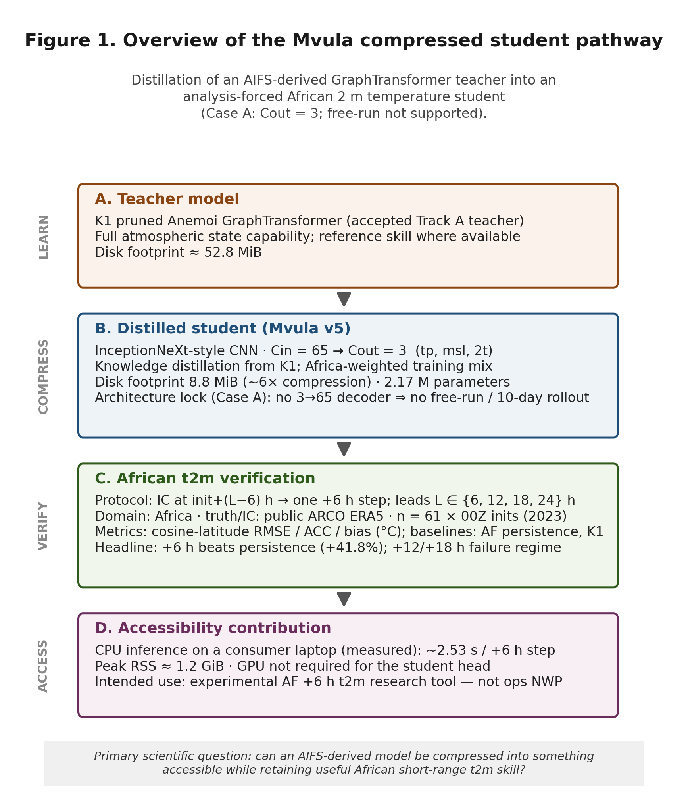

**Figure 1.** Pipeline overview (publication rendering). AIFS → Track A coarsen/prune → K1 teacher → Track B distilled student → AF African t2m scoring and laptop packaging.

### 2.2 Track A — teacher compression

- Phase 0 established an N320 AIFS-family baseline.  
- **A1** grid coarsening passed a ≤5% skill gate vs Phase 0.  
- **A2 / K1** attention-head pruning (1/16 heads + recovery) was **accepted** as the distillation teacher, with a documented precipitation trade-off.  
- The accepted K1 checkpoint is free-run capable but ≈53 MiB on disk — still heavy for the edge narrative.

Evidence: Track A team report and gate JSON artefacts in `reports/`.

### 2.3 Track B — distilled student (v5)

The student is an InceptionNeXt-style CNN:

- **Input:** Cin = 65 multilevel fields (t, u, v, q, z × 13 levels; training normalisation).  
- **Output:** Cout = 3 — `tp`, `msl`, `2t` (ERA5 naming; scored as t2m).  
- **Training:** area-weighted losses with teacher feature / prediction distillation on a 2020–2021 cache; held-out skill emphasis on 2023.  
- **Frozen weights:** `models/student_global_stable_v5.ckpt` (tracked in git, ≈8.8 MiB, ≈2.17 M parameters).

### 2.4 Case A — why evaluation is analysis-forced

The Cout=3 head does **not** reconstruct a 65-channel atmospheric state. Therefore **autonomous free-run is technically impossible**: the next-step input cannot be formed from the student output alone.

**Case A (intentional):** each scored lead \(L \in \{6,12,18,24\}\) uses an ERA5 analysis IC at `init+(L−6)h`, then **one** +6 h student step. Multi-lead curves are therefore **lead-conditioned AF skill**, not accumulated free-run error.

### 2.5 Evaluation protocol

| Item | Setting |
|------|---------|
| Domain | Africa analysis box (land-masked maps) |
| Inits | 61 dates in 2023 across DJF / MAM / JJA / SON |
| Leads | 6, 12, 18, 24 h |
| Truth / ICs | Public ARCO ERA5 |
| Metrics | Cosine-latitude RMSE, ACC, bias vs ERA5 |
| Teacher baseline | K1 where available (**n = 3** January 2023 weekly inits for degradation %) |
| Primary variable | **t2m**; **tp** out of scope (dry-collapse) |

Compute for training/eval campaigns used **Cassava AI Factory** GPUs; CHPC Lengau supported Track A / environment work.

---

## 3. Results

### 3.1 Lead-time skill (African t2m)

| Lead | n | Student RMSE (°C) | Student ACC | Bias (°C) | K1 RMSE | Deg. vs K1 |
|-----:|--:|------------------:|------------:|----------:|--------:|-----------:|
| +6 h | 61 | **1.38** | **0.97** | −0.12 | 1.22 | **+17%** |
| +12 h | 61 | 7.80 | 0.45 | **−5.33** | 1.70 | +360% |
| +18 h | 61 | 4.38 | 0.75 | −1.12 | 1.47 | +204% |
| +24 h | 61 | **3.23** | **0.84** | +1.30 | 1.47 | **+103%** |

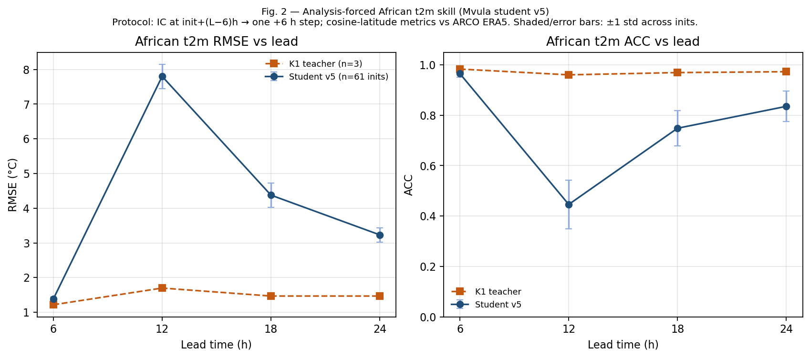

**Figure 2.** Lead-time skill curves. +6 h is competitive; +12 h collapses; +18/+24 h partially recover but remain far from K1.

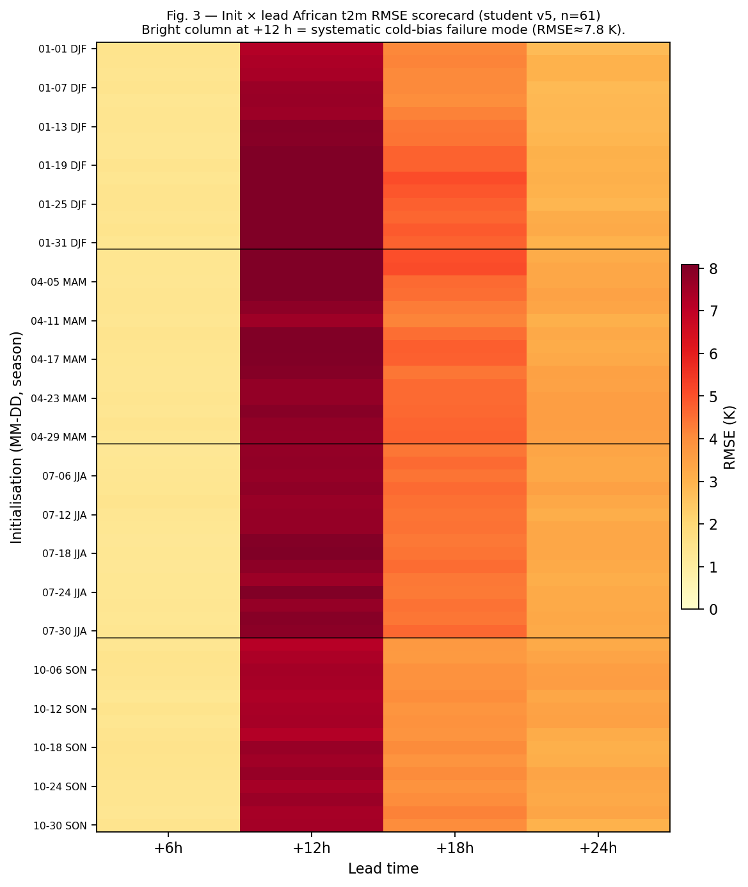

**Figure 3.** Per-initialisation × lead RMSE heatmap. The +12 h band is systematically elevated across the campaign.

**Critical findings**

1. **+6 h remains strong outside DJF** (non-DJF mean RMSE ≈1.37 °C).  
2. **RMSE grows ≈+134% from +6 h to +24 h**, in every season.  
3. **+24 h degradation vs K1 ≈+103%** persists (K1 n=3 caveat).

### 3.2 Seasonal structure

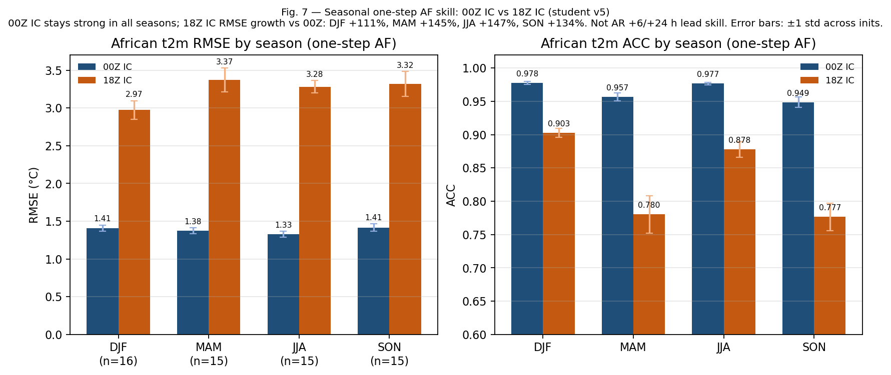

**Figure 7.** Seasonal panels confirm that the +12 h pathology and +24 h degradation are not a single-season artefact.

### 3.3 Spatial structure at +6 h and +24 h

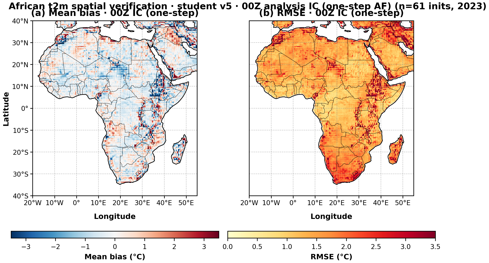

**Figure 4.** Africa maps at **+6 h**: bias (left) and RMSE (right). Errors are spatially structured but moderate in magnitude.

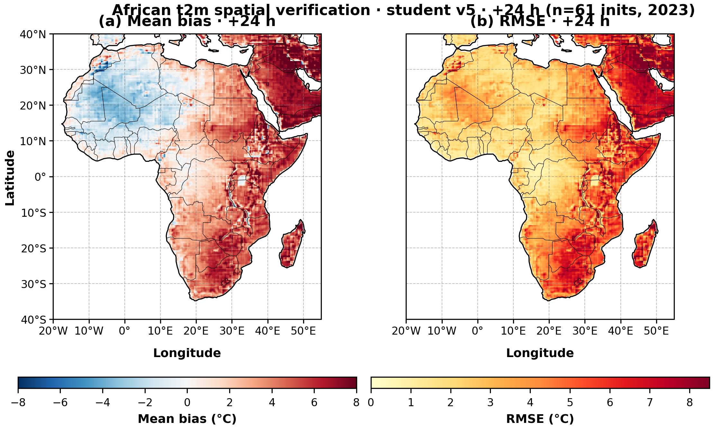

**Figure 5.** Same layout at **+24 h**: larger RMSE and more organised bias patterns.

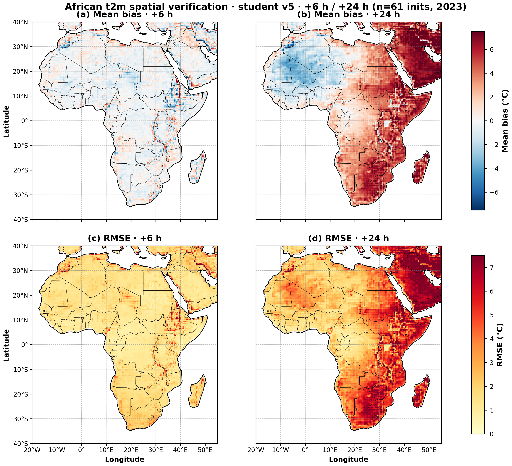

**Figure 10.** Publication quad with shared colour scales: (a–b) mean bias at +6/+24 h; (c–d) RMSE at +6/+24 h.

### 3.4 The +12 h failure mode

At +12 h, mean bias is **−5.33 °C** and **61/61** initialisations are cold (range ≈[−5.76, −4.91] °C). Under the AF protocol, +12 h for 00Z inits uses an **06Z** ERA5 IC — consistent with a **diurnal / lead-conditioned** error regime rather than random scatter.

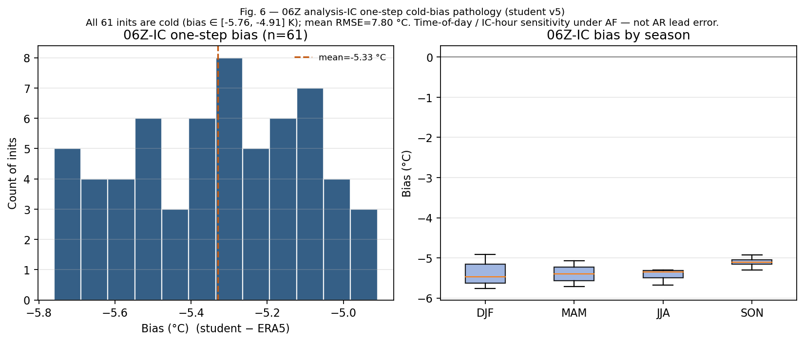

**Figure 6.** +12 h pathology summary across the packaged campaign.

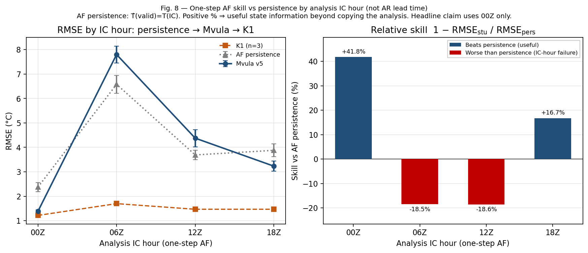

**Figure 8.** Baseline comparison (including persistence). Persistence beats the student at +12/+18 h — underscoring that the failure is systematic, not a minor calibration miss.

### 3.5 Explainability — what the network listens to

Gradient saliency on African-mean predicted **2t** (climate IC + noise; not yet ARCO diurnal contrast) shows strongest sensitivity to **thermodynamic and moisture** multilevel channels (group shares ≈ t 45%, z 24%, q 16%), with top channel **`t1000`**.

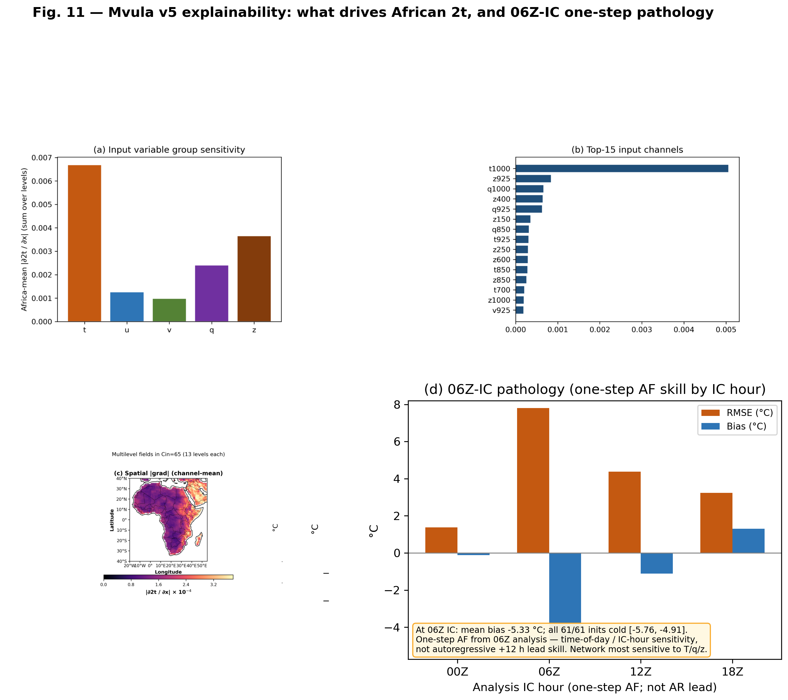

**Figure 11.** (a) Variable-group sensitivity; (b) top channels; (c) spatial |grad| (longitude-corrected Africa crop); (d) packaged AF skill and +12 h cold-bias note.  
Detail: [`MVULA_XAI_ATTRIBUTION.md`](MVULA_XAI_ATTRIBUTION.md).

This is **model explainability**, not a full causal physical proof. It supports interpreting the student as a near-surface thermodynamic mapper under AF ICs, and the +12 h collapse as a coherent failure mode.

### 3.6 Compression and laptop deployment

| Metric | Student v5 | K1 teacher |
|--------|------------|------------|
| Disk size | **8.8 MiB** | 52.8 MiB (≈**6×**) |
| Parameters | **2.17 M** | Anemoi GraphTransformer scale |
| +6 h step (CPU, 4 threads) | **≈2.53 s** | — |
| Peak process RSS | **≈1.19 GiB** | — |
| Discrete GPU required | **No** | Typically yes |
| Free-run 10-day | **Not supported** | Supported |

Hardware for the close-out bench: Intel Core **i7-11800H**, ≈32 GiB RAM, Windows, CPU-only Torch.

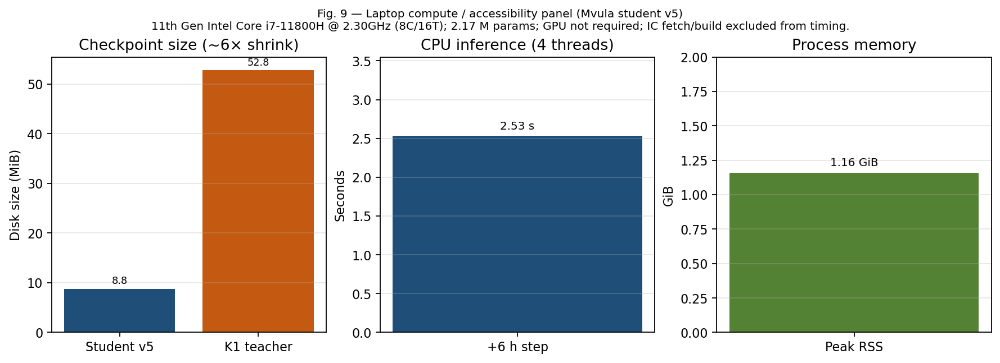

**Figure 9.** Compression and laptop inference summary for the v5 freeze.  
Detail: [`MVULA_LAPTOP_BENCHMARK.md`](MVULA_LAPTOP_BENCHMARK.md).

Timing **excludes** ERA5 IC fetch/build. ONNX/INT8 packaging was not required for this close-out.

---

## 4. Discussion

### 4.1 What success looks like here

Mvula v5 is successful as a **scoped** demonstration:

- Large **on-disk compression** vs the accepted teacher.  
- **Useful +6 h African t2m** under AF ICs.  
- **Runnable on a normal laptop CPU**.  
- Open artefacts (code, figures, scorecards, Apptainer/conda paths).

### 4.2 What it is not

Avoid calling the student an **“AIFS emulator”** or **“10-day AI NWP”** in this freeze. It is a **distilled partial-state student** evaluated **analysis-forced**. LoRA regional adaptation and full free-run require new architecture (Cout≥65 + appropriate curriculum), not a v5 fine-tune.

### 4.3 Why +12 h matters scientifically

The +12 h cold bias is the clearest negative result and should stay in the narrative. It shows:

- AF multi-lead tables can expose **lead-conditioned** failure even when +6 h looks strong;  
- baselines (persistence) remain essential;  
- explainability + protocol notes prevent “black box surprise” framing.

### 4.4 Limitations

- K1 degradation % uses **n=3** overlapping inits.  
- t2m-only primary skill; **tp** failed.  
- XAI uses climate+noise IC, not yet matched 00Z vs 06Z ARCO attribution.  
- No formal Africa extremes ≤20% gate closure.  
- No finished NMHS ONNX product.

### 4.5 Future work

1. Full-state student (Cout≥65) enabling free-run curricula.  
2. Precipitation head redesign.  
3. Lead-conditioned ARCO XAI (+6 vs +12).  
4. Optional ONNX Runtime packaging for NMHS distribution.  
5. LoRA / ENACTS adapters if regional fine-tuning returns to scope.

---

## 5. Reproducibility and open artefacts

```text
git clone https://github.com/msovara/lapai-forecast-africa.git
cd lapai-forecast-africa
# optional: git checkout trackb-v5-c4e

conda env create -f environment-mvula-enduser.yml
conda activate mvula-enduser
pip install -e ".[dev,data,ort]"
python run_mvula.py info | bench | dashboard
```

Apptainer path: `containers/README.md`.  
Scorecard: [`TRACKB_T2M_EXPANDED.md`](TRACKB_T2M_EXPANDED.md).  
Methodology: [`TRACKB_METHODOLOGY_HANDOVER.md`](TRACKB_METHODOLOGY_HANDOVER.md).  
Case A: [`TRACKB_STATE_CLOSURE.md`](TRACKB_STATE_CLOSURE.md).

**Licence:** Apache-2.0 (code); CC-BY-4.0 (documentation); student checkpoint provided for research/evaluation (teacher weights remain under original terms).

---

## 6. Conclusions

Mvula shows that an AIFS-derived teacher can be distilled into a **≈9 MiB** student that (i) delivers **strong analysis-forced African t2m at +6 h**, (ii) **runs in seconds on a laptop CPU**, and (iii) fails in a **diagnosable** way at +12 h under AF 06Z ICs. The project therefore supports a **laptop-scale, short-range African temperature** use case — **not** the originally envisioned free-running 10-day global AIFS-on-laptop product.

> **One sentence:** Mvula v5 is a successful compression-and-short-range-t2m demonstration for Africa on a CPU-scale footprint — not a finished 10-day free-running laptop AIFS.

---

## Acknowledgements

- **Cassava AI Factory** (Cassava Technologies) — GPU access for training and AF evaluation.  
- **CHPC** (Lengau), South Africa — HPC environments and Track A support.  
- **ECMWF** — AIFS checkpoints and Anemoi.  
- **NSF NCAR MILES** — CREDIT framework.  
- **ECMWF Code for Earth** — African Stream mentoring and programme support.  
- AfriClimate AI — community context for open, Africa-scored methods.

---

## Appendix A — Figure inventory

| Fig. | File | Role |
|-----:|------|------|
| 1 | `mvula_fig01_pipeline_publication.png` | Pipeline |
| 2 | `mvula_fig02_t2m_lead_curves.png` | Lead RMSE/ACC |
| 3 | `mvula_fig03_t2m_init_lead_heatmap.png` | Init×lead RMSE |
| 4 | `mvula_fig04_t2m_spatial_plus6h.png` | Spatial +6 h |
| 5 | `mvula_fig05_t2m_spatial_plus24h.png` | Spatial +24 h |
| 6 | `mvula_fig06_t2m_plus12h_pathology.png` | +12 h pathology |
| 7 | `mvula_fig07_t2m_seasonal.png` | Seasonal skill |
| 8 | `mvula_fig08_t2m_baselines.png` | Baselines |
| 9 | `mvula_fig09_compute_panel.png` | Compute/laptop |
| 10 | `mvula_fig10_t2m_spatial_6h_24h_quad.png` | Spatial quad |
| 11 | `mvula_fig11_t2m_xai_attribution.png` | XAI + +12 h why |

Single-panel RMSE/bias maps also available as `trackb_t2m_v5_{rmse,bias}_L{006,024}h.png`.

---

## Appendix B — Claim boundary (copy for slides)

| We claim | We do not claim |
|----------|-----------------|
| ≈6× smaller student vs K1; laptop CPU inference | 10-day free-running student |
| AF African t2m skill +6…+24 h | Full multi-var free-run Week-9 table |
| Open code + packaged eval | Operational NMHS pilot / LoRA adapters |
| Honest Case A (Cout=3) limit | That v5 “is” a closed dynamical NWP emulator |
