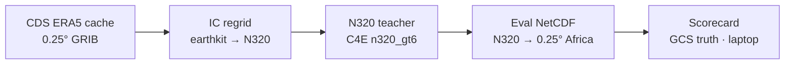
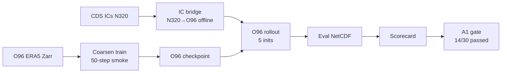

<!-- _class: lead -->

# LapAI-Forecast
## Track A progress — team status

**Mthetho Sovara** · CHPC Lengau  
Phase 0 closed · Track A smoke pipeline end-to-end · 2024–2025 verification next

---

## Plain English — where we are

> We got the **coarsened weather model** working all the way through on Lengau — **train it, run forecasts offline, score them** — and we are now aligning with Sh on **who runs which GPU jobs** and **how initial conditions** should be handled for 2024–2025.

| Item | Status |
|------|--------|
| Phase 0 (N320 teacher) | **Closed** — Jan 2023 baseline scorecard |
| Track A pipeline | **Green** — train → forecast → score → gate |
| A1 gate (smoke run) | **Failed** — 14/30 checks (expected for 50-step smoke) |
| Forecasts scored | **5 inits** — 20230101–20230129 |

---

<!-- _class: small -->

## Phase 0 — N320 teacher baseline (done)

**Offline Lengau flow** · Jan 2023 weekly inits · Africa 0.25° eval grid

**Deliverable:** `reports/PHASE0_BASELINE_SCORECARD.json` — teacher skill ceiling for Track A

---

<!-- _class: small -->

## Track A — coarsened O96 student (smoke run)

**Pipeline validated end-to-end** · gate not passed on reduced smoke config

**Lengau jobs:** 7318569 (train) · 7318585 (forecast)

---

## IC regridding — Mario vs current approach

| | Today (Lengau) | Target (2024–2025) |
|---|----------------|---------------------|
| **Hook** | Post-fetch bridge in `run_phase0_forecast.py` | O96 in IC builder (`cds_ic.py` / open-data path) |
| **Method** | scipy k-NN IDW (offline) | `earthkit-regrid` → O96 |
| **Why bridge first?** | Phase 0 was N320-first; O96 earthkit cache not pre-staged | Canonical benchmark definition |
| **Lengau offline?** | Yes — no GPU internet needed | Yes — pre-cache matrices on laptop, rsync (same as N320 Phase 0) |

**Training** already uses native **O96 Zarr** · workaround is **forecast ICs only**

---

## 2024–2025 verification split (Sh's proposal)

| **We · Lengau (CHPC)** | **Sh · Oxford** |
|-------------------------|-----------------|
| Coarsened **O96 student** train + forecast | **N320 AIFS** production runs (~5–9 days for 2 years) |
| CDS + IC path (→ Mario O96-at-fetch) | Native **O96 AIFS** optional if not parallel |
| Score vs Phase 0 + Oxford outputs | CDS pipeline (not open-data) |
| Offline GPU jobs (no outbound internet) | Unlimited Oxford GPUs |

**Team goal:** paired N320 vs O96 vs coarsened-O96 · same inits · same leads · same scorecard

---

<!-- _class: small -->

## Done vs next steps

**Completed**
- Phase 0 closed · Lengau lustre env (anemoi 0.14, sklearn, trimesh fixes)
- Track A smoke coarsen train (finite loss, O96 ckpt)
- 5 offline forecasts · GCS scorecard · A1 gate script
- IC design doc in `PLAN.md` §4.1 · `PHASE0_CLOSURE.md`

**Next**
1. Mario-style O96 IC builder + earthkit O96 cache prep
2. Rebuild full training Zarr (fix missing timesteps)
3. Longer coarsen fine-tune → real A1 gate attempt
4. Lock init calendar with Sh · 2024–2025 paired verification

**Repo:** `lapai-forecast` · **Docs:** `PLAN.md`, `reports/PHASE0_CLOSURE.md`

---

<!-- _class: lead -->

# Questions?

**IC path:** coarsened O96 in parallel while Sh runs N320?  
**Native O96 AIFS:** Oxford only, or also needed from Lengau?
